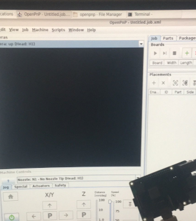

# OpenPnP kiosk 

This repository deploys [OpenPnP](https://github.com/openpnp) software automatically on an `aarch64` compatible hardware, **currently targetting rpi3, rpi4 and Jetson Nano SBCs**.

# Quickstart

So, how do I get this to work on my Raspberry Pi 4 or Jetson nano quick?

[First, follow steps 1 to 4 on balena.io][quickstart].. instead of balena-dash use this openpnp-kiosk repository (the one you are reading this README.md from).

[When those steps are completed, deploy the openpnp-kiosk "app" using the Balena CLI tools][software_deploy].

# How does this work?

The building is accomplished by bundling the dependencies and some library hacks (due to ongoing pending work upstream) on a docker container. The release engineering and deploy management is handled by [Balena][balena].

[Balena][balena] (:whale: in Catalan) allows to deploy a ["kiosk"][x11_balena] version of OpenPnP. Think of Balena as a free (as in beer) alternative to [AWS IoT Greengrass][aws_greengrass], [Google Cloud IoT][gcloud_iot] or [Azure IoT][azure_iot], to name a few payware platforms.

# Developing

Great! You want to add some tweaks to this project? To build locally before pushing to Balena cloud (or use it somewhere else):

```bash
docker buildx build --platform linux/arm64 . -f Dockerfile.raspberrypi3-64
```

Alternatively, you can just install the software on the RPi itself running the commands found in the Dockerfile itself, no cloud nor docker involved ;)

## TODO

It works! 



But as always there are some tweaks left to do:

* Make sure udev and USB docker container pass-through is stable for cameras and control board.
* Upgrade to upstream's OpenCV 4.x, taking advantage of system's Debian packages and removing the custom-compiled `libopencv_java342.so`.
* ~~Report upstream on OpenPnP that JNErator and JNA/JNI need to be updated to at least 4.5.1, otherwise `obj/libjnidispatch.so` and `LD_LIBRARY_PATH` hacks are needed for newer Linux distributions.~~
* Investigate on upstream's OpenPnP migration to Java11 so that, potentially, we could run with [GraalVM for `aarch64`][graalvm_aarch64]... current performance is a bit worrying.
* ~~Get PRs for [openpnp-capture-java](https://github.com/openpnp/openpnp-capture-java/pull/3) and [openpnp-capture](https://github.com/openpnp/openpnp-capture/pull/35) merged upstream.~~
* Provision different machines, not just the LitePlacer.
* Provision properly populated `parts.xml` and `packages.xml`. Come up with a better provisioning mechanism than updating those two files periodically.
* Find testers for the (untested yet) Jetson Nano Dockerfile.
* Make Java UI style more modern looking-like, the default awt look is horrible :P

[gcloud_iot]: https://cloud.google.com/solutions/iot
[aws_greengrass]: https://aws.amazon.com/greengrass/
[azure_iot]: https://azure.microsoft.com/en-us/overview/iot/
[x11_balena]: https://github.com/balenalabs-incubator/x11-window-manager
[balena]: https://www.balena.io/
[graalvm_aarch64]: https://github.com/graalvm/graalvm-ce-builds/releases/tag/vm-20.0.0
[quickstart]: https://www.balena.io/blog/make-a-web-frame-with-raspberry-pi-in-30-minutes/#setupoftheraspberrypi
[software_deploy]: https://www.balena.io/blog/make-a-web-frame-with-raspberry-pi-in-30-minutes/#deployingcode
